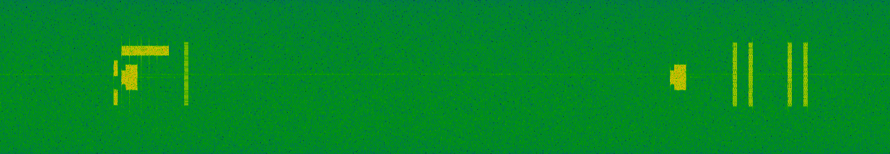
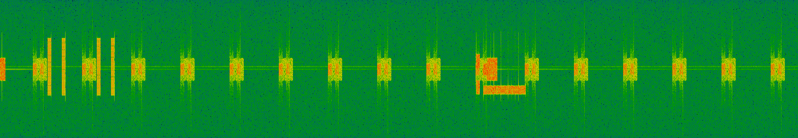

# SSB-Spoofer

<div align="center">
⚠️ <b>WARNING: This tool is for authorized security research and educational purposes only.</b> ⚠️
</div>
<br>

SSB-Spoofer is a free open-source 5G Synchronization Signal Block (SSB) spoofing tool designed for security research and testing. The tool intercepts legitimate SSB signals from 5G base stations (gNBs), modifies critical Master Information Block (MIB) parameters, and retransmits spoofed SSB signals to prevent User Equipment (UE) network attachment. SSB-Spoofer is optimized to overcome several challenges in 5G NR signal manipulation and provides an effective denial-of-service capability against 5G devices.

The tool decodes authentic SSB signals, extracts the MIB information, applies strategic modifications (such as setting cell_barred flag, corrupting CORESET0 indices, and invalidating SearchSpace0 configurations), and continuously transmits the spoofed signals to overpower legitimate gNB transmissions.

This research tool was developed as part of security research into 5G network vulnerabilities and cellular communication protocols.

## Features

- **5G NR SSB Signal Interception**: Captures and decodes legitimate SSB transmissions
- **MIB Parameter Manipulation**: Modifies critical MIB fields to prevent UE attachment
- **Continuous Signal Transmission**: Overpowers legitimate gNB signals through continuous spoofed SSB transmission
- **SDR Hardware Support**: Compatible with USRP B200/B210 and other UHD-supported devices
- **Configurable Attack Parameters**: Flexible configuration for different attack scenarios
- **Real-time Signal Processing**: Live capture, modification, and retransmission pipeline

## Attack Capabilities

### Primary Attack Vectors
- **Cell Barring**: Sets `cell_barred` flag to true, causing UEs to reject the cell
- **CORESET0 Corruption**: Invalidates PDCCH configuration by setting illegal CORESET0 indices
- **SearchSpace0 Manipulation**: Corrupts SIB1 search space configuration


## Dependencies

All required dependencies can be installed on Ubuntu with the following:

```bash
sudo apt-get update
sudo apt-get install cmake make gcc g++ pkg-config libfftw3-dev libmbedtls-dev \
    libsctp-dev libyaml-cpp-dev libgtest-dev libliquid-dev libconfig++-dev \
    libzmq3-dev libspdlog-dev libfmt-dev libuhd-dev uhd-host
```

### srsRAN Installation
SSB-Spoofer requires srsRAN libraries for 5G signal processing:

```bash
git clone https://github.com/srsran/srsRAN_4G.git
cd srsRAN_4G
mkdir build && cd build
cmake ..
make -j$(nproc)
sudo make install
sudo ldconfig
```

### Hardware Setup
```bash
sudo apt-get install libuhd-dev uhd-host
# Download UHD firmware
sudo uhd_images_downloader
```

## Building

To build the project run the following:

```bash
mkdir -p build && cd build
cmake ..
make -j$(nproc)
# Optional
sudo make install
sudo ldconfig
```

Add the `-DCMAKE_BUILD_TYPE=Debug` flag to build in developer/debug mode.

### Frequency Configuration

To target a specific 5G cell, configure the center frequency based on your target band:

## Usage Instructions

### Basic Operation

```bash
cd build/SSB-Spoofer
./ssb_spoofer --config ../../config.yaml
```

The tool will:
1. **Initialize SDR hardware** and configure RF parameters
2. **Scan for target SSB** signals at the specified frequency
3. **Decode MIB information** from the legitimate signal
4. **Apply attack modifications** to MIB parameters
5. **Generate and transmit** spoofed SSB signals continuously

### Sample Output

```
========================================================
              5G NR SSB Spoofer v1.0                    
========================================================
 WARNING: This tool is for research purposes only!      
          Unauthorized use may be illegal.              
========================================================

>> Loading configuration from: config.yaml

--------------------------------------------------------
  Initializing RF Device
--------------------------------------------------------

--------------------------------------------------------
  Initializing SSB Processor
--------------------------------------------------------

--------------------------------------------------------
  Starting SSB Scan
--------------------------------------------------------
  Target PCI       : 500
  Scan Duration    : 30 seconds
  RX Buffer        : 23040 samples (1 ms)
  Search Buffer    : 230400 samples (10 ms)
--------------------------------------------------------

>> Initializing receiver...
   Ready. Starting capture...
   Scanning... (2.3s)

>> SSB Detected!
   PCI              : 500
   SSB Index        : 0
   SNR              : 24.7 dB
   RSRP             : -21.2 dBm

=== MIB Information ===
  SFN: 913
  Cell Barred: No
  CORESET0 Index: 6
  SearchSpace Zero Index: 0

--------------------------------------------------------
  Generating Spoofed SSB
--------------------------------------------------------
>> Modifying MIB parameters...
  [ATTACK] Cell Barred: false -> true
  [ATTACK] CORESET0 Index: 6 -> 15
  [ATTACK] SearchSpace0 Index: 0 -> 15
>> Encoding modified MIB...
>> Signal generation complete
   Generated        : 23040 samples
   Amplitude        : 0.70

--------------------------------------------------------
  Transmitting Spoofed SSB
--------------------------------------------------------
  Target PCI       : 500
  Frequency        : 3750.00 MHz
  TX Gain          : 89 dB
--------------------------------------------------------

>> Starting Continuous Attack Mode
   Target PCI       : 500
   Press Ctrl+C to stop...

   Transmitting... 15342 bursts (30s, 511.4 bursts/s)

--------------------------------------------------------
  Attack Statistics
--------------------------------------------------------
  Total Bursts     : 15342
  Total Time       : 30 seconds
  Average Rate     : 511.4 bursts/second
--------------------------------------------------------

========================================================
  Attack Execution Complete
========================================================
```

## Demonstration

The effectiveness of the SSB spoofing attack can be observed through spectrum analysis. The following images show the RF spectrum before and during the attack:

### Without SSB Spoofer

*Normal 5G spectrum showing legitimate SSB signals from the target gNB*

### With SSB Spoofer Active

*Spectrum during attack showing continuous spoofed SSB transmission overpowering legitimate signals*

The spoofed signals appear as continuous high-power transmissions that prevent UE devices from successfully completing cell selection and attachment procedures.

### Advanced Configuration

For targeting specific cells, you may need to:

1. **Identify Target PCI**: Use a spectrum analyzer or cell scanner
2. **Determine Center Frequency**: Find the exact SSB frequency
3. **Optimize TX Power**: Adjust gain to overpower legitimate signals
4. **Configure Attack Parameters**: Select appropriate MIB modifications

## Attack Methodology

### Signal Interception Phase
1. Configure SDR for target frequency and bandwidth
2. Capture 5G NR signals and search for SSB patterns
3. Decode PSS/SSS to identify Physical Cell ID (PCI)
4. Extract and decode MIB from PBCH

### Signal Modification Phase
1. **Cell Barring**: Set `cell_barred = true` to make cell appear unavailable
2. **CORESET0 Corruption**: Set invalid CORESET0 index (15) to break PDCCH decoding
3. **SearchSpace0 Corruption**: Set invalid SearchSpace0 index to prevent SIB1 reception
4. **Power Amplification**: Boost signal power to compete with legitimate gNB

### Transmission Phase
1. Re-encode modified MIB into PBCH payload
2. Generate complete SSB signal with spoofed MIB
3. Transmit continuously to maintain denial of service
4. Monitor transmission statistics and adjust parameters

## Security Considerations

### Legal Usage
- **Research Environments**: Use only in controlled lab settings
- **Authorized Testing**: Obtain proper permissions before deployment
- **Compliance**: Follow local spectrum regulations and laws
- **Responsible Disclosure**: Report vulnerabilities through appropriate channels

### Technical Limitations
- **Range**: Limited by SDR TX power and antenna configuration
- **Detection**: Continuous transmission may be detected by network monitoring
- **Interference**: May affect legitimate network operations in vicinity

## Troubleshooting

### Common Issues

**UE still connects despite spoofing:**
- Increase TX gain to maximum (89 dB for B200)
- Verify target frequency matches cell center frequency
- Check that continuous transmission mode is enabled
- Ensure spoofed signal power exceeds legitimate signal

**SDR hardware not detected:**
- Install UHD drivers: `sudo apt-get install libuhd-dev uhd-host`
- Download firmware: `sudo uhd_images_downloader`
- Check USB connection and try different USB port
- Verify device with: `uhd_find_devices`

**Build errors:**
- Install all dependencies listed above
- Ensure srsRAN is properly installed and configured
- Try building srsRAN from source if packages are outdated

## Contributing

This project is part of the ORAN Testing Library initiative. Contributions are welcome through:

- **Bug Reports**: Submit issues with detailed reproduction steps
- **Feature Requests**: Propose new attack vectors or capabilities
- **Code Contributions**: Follow project coding standards and submit pull requests
- **Documentation**: Improve usage guides and technical documentation

## Acknowledgments

If you use this tool in your research, please cite our work:

```bibtex
@software{ssb_spoofer_2025,
  title={SSB-Spoofer: 5G NR SSB Signal Spoofing Tool},
  author={ORAN Testing Team},
  year={2025},
  url={https://github.com/oran-testing/SSB-Spoofer}
}
```

## License

This project is licensed under the AGPL-3.0 License - see the LICENSE file for details.

---

**Disclaimer**: This tool is intended for security research and authorized testing purposes only. Users are responsible for compliance with applicable laws and regulations. The authors assume no liability for misuse of this software.
